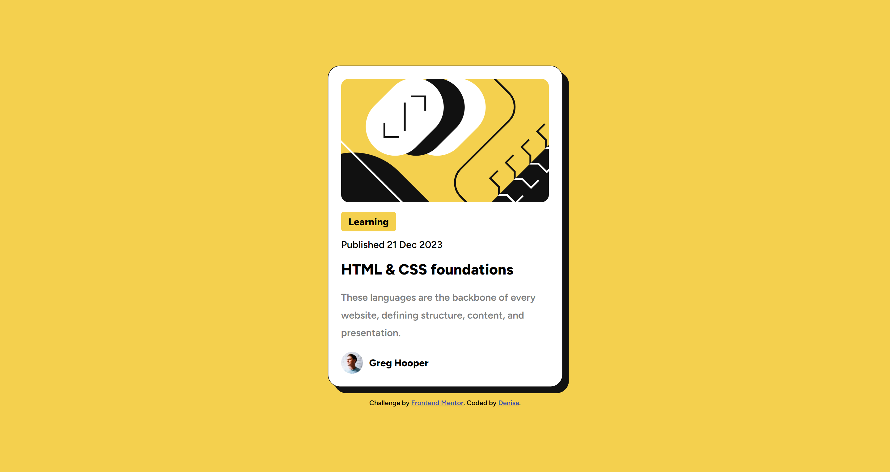

# Frontend Mentor - Blog preview card solution

This is a solution to the [Blog preview card challenge on Frontend Mentor](https://www.frontendmentor.io/challenges/blog-preview-card-ckPaj01IcS). Frontend Mentor challenges help you improve your coding skills by building realistic projects.

## Table of contents

- [Overview](#overview)
  - [The challenge](#the-challenge)
  - [Screenshot](#screenshot)
  - [Links](#links)
- [My process](#my-process)
  - [Built with](#built-with)
  - [What I learned](#what-i-learned)
  - [Continued development](#continued-development)
  - [Useful resources](#useful-resources)
- [Author](#author)

## Overview

### The challenge

Users should be able to:

- See hover and focus states for all interactive elements on the page

### Screenshot



### Links

- [Solution](https://www.frontendmentor.io/solutions/blog-preview-card-QEC85WyL0c)
- [Live Site](https://jocular-pavlova-d069ad.netlify.app/)

## My process

### Built with

- Semantic HTML5 markup
- CSS custom properties
- Flexbox
- Mobile-first workflow

### What I learned

For a moment I couldn't figure out what was going on when it resized, eventually I figured this would help maintain it's height to match the design provided.

```css
.card__img {
  background-color: var(--primary-yellow);
  background-image: url(./assets/images/illustration-article.svg);
  background-size: cover;
  background-repeat: no-repeat;
  background-position: center;
  border-radius: 12px;
  max-width: 100%;
  min-height: 200px;
}
```

### Continued development

I'm sure there's still plenty I could learn however for the time being I think I have a good grasp of html, and css.
As of now I'm try to make it a habit of implementing BEM into it, and be semantic as much as possible. For CSS I'd like to figure out clamp, I hear great things for resizing for clean responsiveness.
Javascript is yet to be mastered therefor I think thats one more thing I'd like to contine learning!

### Useful resources

- [BEM Examples ](https://sparkbox.com/foundry/bem_by_example) - This helped me for BEM how to follow proper practices for it.

## Author

- Website - [My Portfolio](https://www.your-site.com)
- Frontend Mentor - [@moncadad](https://www.frontendmentor.io/profile/moncadad)
